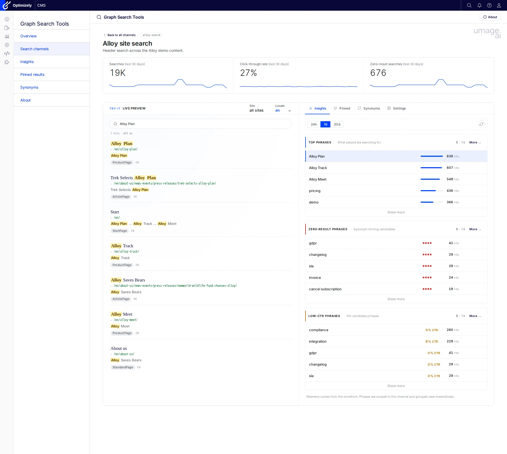
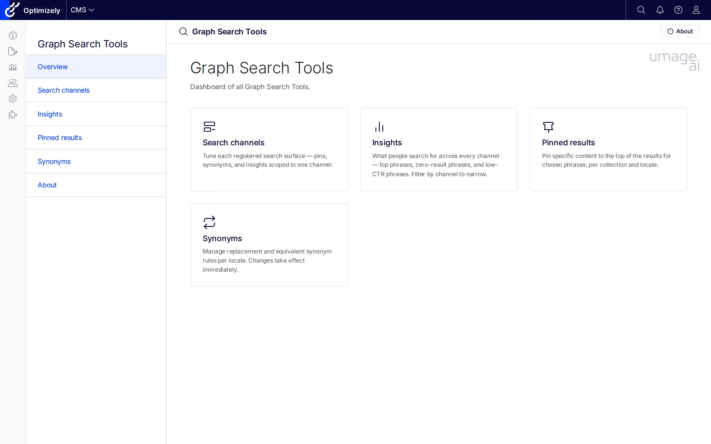
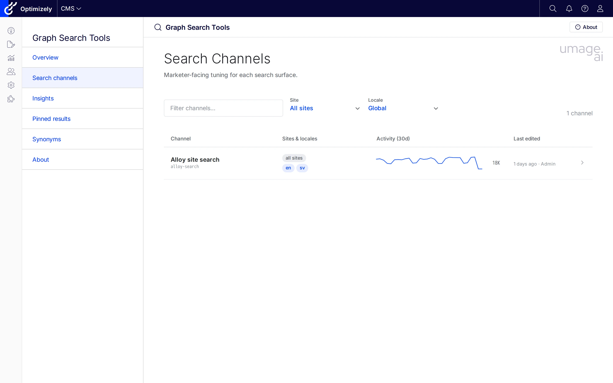
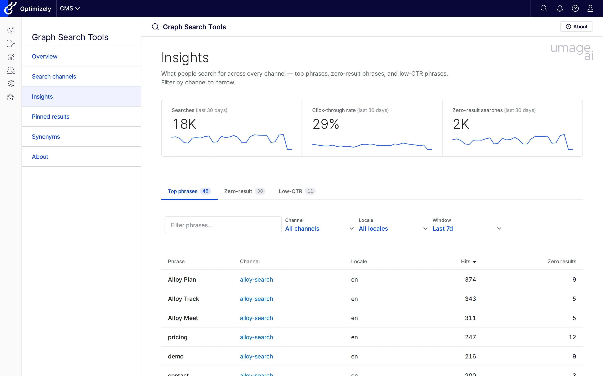
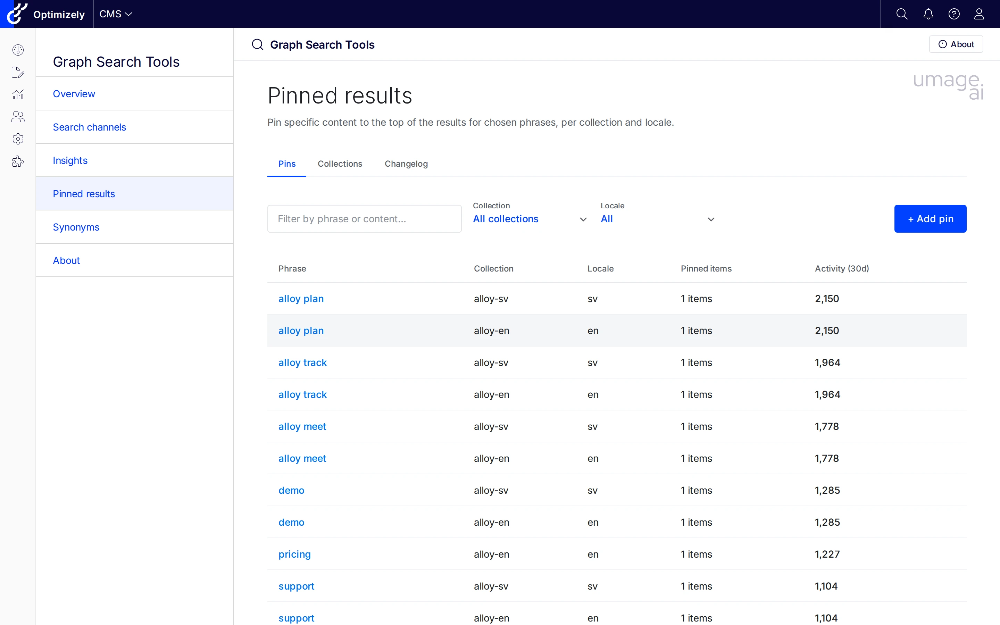
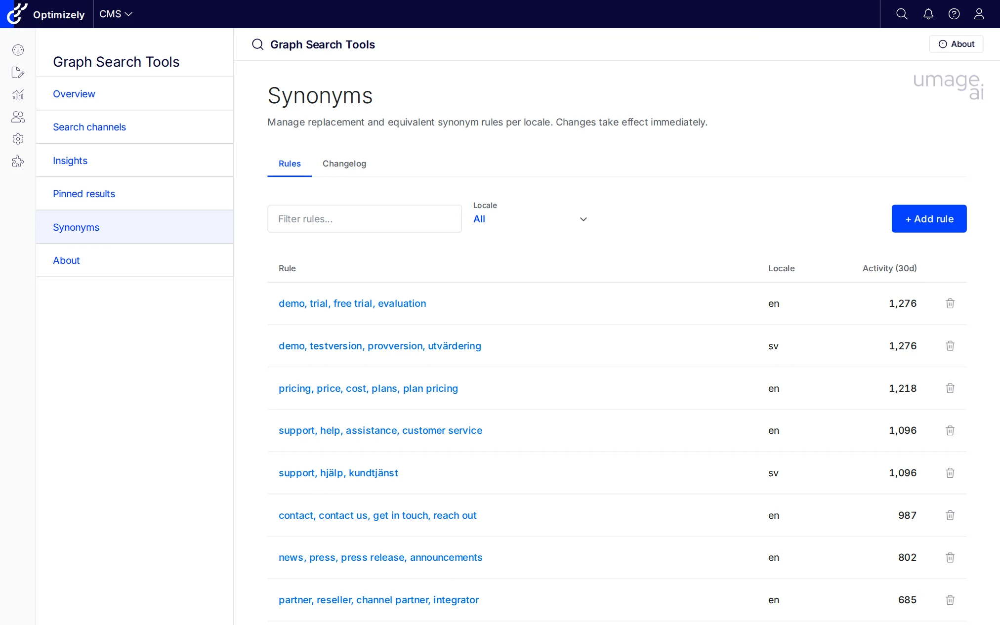

# GraphSearchtools

[](https://github.com/umage-ai/Umage.Optimizely.GraphSearchtools/releases)
[](https://github.com/umage-ai/Umage.Optimizely.GraphSearchtools/actions/workflows/publish.yml)
[](LICENSE)

Marketer-facing admin tooling for **Optimizely Graph** site-search on Optimizely CMS 12 and CMS 13. Pinned-result curation, synonym management, a per-channel try-it playground, and click-through / zero-result insights — all integrated into the CMS shell. Distributed as the NuGet package `UmageAI.Optimizely.GraphSearchTools`.



## Tools

Six menu entries under a top-level **Graph Search Tools** section in the CMS shell:

| Tool | Description |
|------|-------------|
| **Overview** | Landing dashboard with quick-access cards for the other tools. |
| **Search channels** | Per-surface tuning index. Each registered search channel gets a detail page with KPI strip, Try-it live preview, and Insights / Pinned / Synonyms / Settings tabs scoped to that surface. |
| **Insights** | Cross-channel marketer dashboard. Top phrases, zero-result candidates, low-CTR phrases, filterable by channel and locale over a 7d / 30d window. |
| **Pinned results** | Tenant-wide pin browser with Pins / Collections / Changelog tabs. Filter pins by collection or locale; jump to the owning channel with one click. Hits / CTR / zero-result columns surface coverage signals (unpublished targets, expired pins, low-CTR pins) inline. |
| **Synonyms** | Replacement and equivalent synonym rules with a Rules + Changelog tab strip. Filter by scope (per-locale and tenant-global pools). Activity column shows last-30-days impact, and unused / missing-synonym signals surface in the same grid. |
| **About** | Colophon: version, license, included tools, links. |

Behind the scenes the addon also exposes a public ingest beacon (`POST /api/telemetry/searchlog`) feeding a self-contained DDS sink — the data source for every analytics surface above. No external pipeline required.

## Screenshots

### Overview



Dashboard of all Graph Search Tools, with quick-access cards for each surface.

### Search channels



Index of every registered channel. Filter by site or locale. Activity sparkline and totals come from the search-log table so you can spot dormant surfaces at a glance.

### Channel detail


KPI strip (searches / CTR / zero-result) plus a Try-it live preview that runs the same GraphQL document your production storefront fires. The right pane swaps between **Insights** (per-channel top phrases / zero-result / low-CTR) and **Pinned / Synonyms / Settings** tabs without losing the preview state.

### Insights



Cross-channel marketer dashboard. Switch tabs between Top phrases, Zero-result phrases, and Low-CTR phrases; filter by channel, locale, and 7d / 30d window. The shorter 1h / 24h windows live one level down on each Channel detail page, where they share state with the Try-it preview.

### Pinned results



Tenant-wide pin browser. The **Pins** tab lists one row per `(phrase, collection, locale)` with the resolved channel link, item count, and last-30-days activity from search logs; a sibling **Collections** tab manages the underlying pinned-result collections, and **Changelog** records every create / update / delete sent to Graph.

### Synonyms



Replacement and equivalent rules per locale, with last-30-days activity. Graph synonyms live in a tenant-global pool, so this surface is channel-agnostic by design.

## Search channels

A **search channel** is a developer-declared description of one search surface in the customer solution (header search, product listing, knowledge base, …). Channels are registered at startup and scope the marketer-facing Pinned editor to the keys the production GraphQL query actually consumes — so a pinned result added in the CMS shell is guaranteed to fire in the live query rather than disappearing into a tenant-global collection nobody reads.

Register channels with the fluent `AddSearchChannel(...)` extension on the builder returned by `AddGraphSearchtools`:

```csharp
// src/GraphSearchtools.SampleSite/Startup.cs
services.AddGraphSearchtools()
    .AddSearchChannel("alloy-search", p => p
        .DisplayName("Alloy site search")
        .Description("Header search across the Alloy demo content.")
        .LocalesFromCmsLanguages()
        .SearchedFields("Name", "MetaDescription", "MainBody")
        .UsesPinnedKey("alloy-{locale}")
        .GraphQLDocumentInline(AlloySearchService.SampleHitsQueryDocument));
```

| Builder method | What it does |
|---|---|
| `DisplayName(string\|LocalizedString)` | Display name shown on the Channels index and detail header. Accepts a literal string or a localization key. |
| `Sites(params string[])` | `SiteDefinition.Name` values this channel applies to. Empty list (default) means "all sites". |
| `Locales(params string[])` / `LocalesFromCmsLanguages()` | BCP-47 language codes that drive the locale picker. Use the CMS-derived helper to track enabled language branches automatically. |
| `SearchedFields(params string[])` | Field names searched by the production query. Surfaced on the Channel detail page so the admin matches what the live storefront queries. |
| `UsesPinnedKey(string \| Func<string,string>)` | The Graph pinned-collection key formula. String templates may contain `{locale}`, e.g. `"alloy-{locale}"`; pass a `Func<string,string>` for fully dynamic per-locale keys. |
| `GraphQLDocument(string path)` / `GraphQLDocumentInline(string body)` | The GraphQL document the production code uses for this surface. Optional — when omitted the Try-it side panel is disabled but Pinned editing still works. The Channel detail page reads the document's `_ranking` / `_semanticWeight` arguments to label the ranking pill, so what's shown matches what the storefront actually asks Graph for. |
| `Variables(object \| IDictionary<string,object?>)` | Default variables passed to the GraphQL document in addition to the runner-controlled ones (`q`, `locale`, `limit`, …). |

When no channels are registered the addon synthesises a single **Generic** channel so zero-config installs keep working: the Channels index shows one row, and the Pinned tab on it falls back to the legacy free-form collection-name editor.

## CMS 12 and CMS 13

GraphSearchtools is multi-targeted: the same NuGet package supports both Optimizely CMS 12 (.NET 8) and CMS 13 (.NET 10). The addon talks to Optimizely Graph directly over HTTP — it does **not** depend on `Optimizely.ContentGraph.Cms` (CMS 12) or `Optimizely.Graph.Cms.ContentSources` (CMS 13), so it works against any tenant the host can reach, however the host wires up content sync.

| | CMS 12 | CMS 13 |
|---|---|---|
| Target framework | net8.0 | net10.0 |
| Host package for content sync | `Optimizely.ContentGraph.Cms` 4.x | `Optimizely.Graph.Cms.ContentSources` 13.x |
| Shell base path | `/EPiServer/CMS/` | `/Optimizely/CMS/` |
| Addon API surface | identical | identical |

The repo ships two reference sample sites — `src/GraphSearchtools.SampleSite` (CMS 12) and `src/GraphSearchtools.SampleSiteCms13` (CMS 13) — to use as templates for either platform version.

## Installation

```bash
dotnet add package UmageAI.Optimizely.GraphSearchTools
```

### Registration

In your `Startup.cs`:

```csharp
public void ConfigureServices(IServiceCollection services)
{
    // ... other services

    services.AddGraphSearchtools(options =>
        {
            // Optional: configure roles with full access
            // (defaults cover standard CMS-admin and edit-mode groups).
            options.AuthorizedRoles = ["WebAdmins", "Administrators"];

            // Optional: disable per-tool access control
            // (default: true; granular permissions via CMS admin UI).
            options.CheckPermissionForEachFeature = true;
        })
        .AddSearchChannel("alloy-search", p => p
            .DisplayName("Alloy site search")
            .LocalesFromCmsLanguages()
            .SearchedFields("Name", "MetaDescription", "MainBody")
            .UsesPinnedKey("alloy-{locale}")
            .GraphQLDocument("Queries/AlloySearch.graphql"));
}

public void Configure(IApplicationBuilder app)
{
    // ... other middleware

    app.UseEndpoints(endpoints =>
    {
        endpoints.MapContent();
        endpoints.MapGraphSearchtools(); // Required: maps tool routes
    });
}
```

## Configuration

```json
{
  "Optimizely": {
    "ContentGraph": {
      "GatewayAddress": "https://cg.optimizely.com",
      "AppKey": "...",
      "Secret": "...",
      "SingleKey": "..."
    }
  },
  "UmageAI": {
    "GraphSearchTools": {
      "AuthorizedRoles": ["WebAdmins", "Administrators"],
      "CheckPermissionForEachFeature": true,
      "Features": {
        "Overview": true,
        "Channels": true,
        "Insights": true,
        "Pinned": true,
        "Synonyms": true,
        "PinnedCoverage": true,
        "SynonymCoverage": true,
        "SearchLogs": true,
        "Telemetry": true
      }
    }
  }
}
```

The addon reuses the host's `Optimizely:ContentGraph` credentials by default. Per-environment overrides can be set under `UmageAI:GraphSearchTools:Graph`; any value left blank falls back to the host's block.

## Permissions

Three-layer permission model:

1. **Feature toggles** — Enable/disable individual tools via the `Features` block in configuration. A disabled tool is hidden from the menu and its routes return 404.
2. **Role-based access** — `AuthorizedRoles` grants full access (defaults cover the standard CMS-admin and edit-mode groups).
3. **Permissions For Functions** — With `CheckPermissionForEachFeature = true` (default), each tool can be granted to specific users/roles in the CMS admin UI under "Permissions For Functions". The full set is `Channels`, `Insights`, `Pinned`, `PinnedEdit`, `Collections`, `Synonyms`, `SynonymsEdit`. `Synonyms` splits view + edit; `Pinned` splits three ways (view, item-edit, and `Collections` for the collection shells themselves); `Insights` is the umbrella permission for every read-only analytics surface (Insights dashboard, per-channel Insights tab, coverage signals). On first boot `PermissionSeeder` grants every permission to the configured `AuthorizedRoles` so a fresh install never locks anyone out.

## Scheduled Jobs

| Job | Purpose |
|-----|---------|
| **Graph Search Tools — Telemetry retention** | Trims aged buckets from the local search-log store and ages out the per-instance forensic raw ring. Configure retention via `UmageAI:GraphSearchTools:Telemetry:BucketRetention` (a `TimeSpan`, default 90 days). |

Run on demand from the CMS admin Scheduled Jobs page.

## Documentation

- [Integrator quickstart](docs/integrator/quickstart.md) — install, register a search channel, and see a telemetry event in Insights.
- [Server-rendered ASP.NET pattern](docs/integrator/pattern-server-rendered.md) — inject `ITelemetrySink` and emit events from your search controller.
- [Headless deployment pattern](docs/integrator/pattern-headless.md) — beacon events from a SPA/SSR frontend to the public ingest endpoint.
- [3rd-party telemetry pattern](docs/integrator/pattern-third-party-telemetry.md) — decorate `ITelemetrySink` to fan out, or replace `ITelemetryReader` to source aggregates from your own warehouse.
- [Design system](docs/design-system.md) — shared visual patterns and components.
- [Personas](docs/personas.md) — who the addon is designed for.
- [Optimizely Graph research notes](docs/research/) — reference docs on Graph capabilities, relevancy, and authentication.

## Tech Stack

- .NET 8 / .NET 10 / C# / Optimizely CMS 12 and CMS 13 (single multi-targeting NuGet package)
- Vanilla JavaScript and CSS (no framework dependencies, no build step)
- Razor SDK class library with embedded views and static assets
- DynamicDataStore (DDS) for persistence
- Protected module integration with the CMS shell
- 11 language files included for localization (en, da, sv, no, de, fi, fr, es, nl, ja, zh-CN)

## Contributing

See [`CLAUDE.md`](CLAUDE.md) for architecture patterns and conventions.

## License

MIT — see [LICENSE](LICENSE).

Powered by [umage.ai](https://umage.ai).
